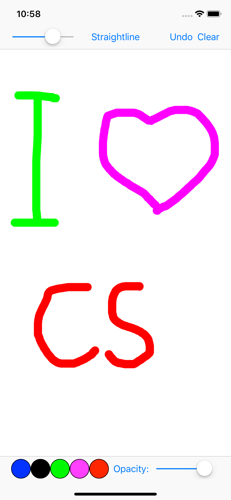

# iOS-Development-Drawing app
Make a drawing app by using UIKit, Core Graphics and the built-in Cocoa Touch frameworks. Finally, I can draw smooth lines with different width and color of the lines. And also use different buttons to undo and clear lines.

